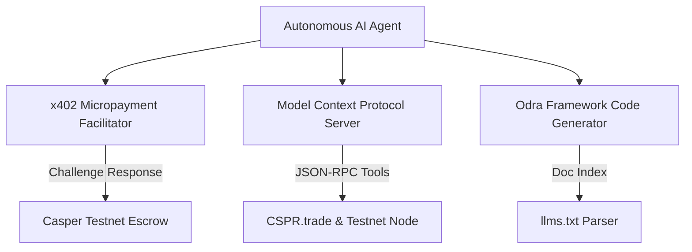

# Casper Nexus - AI Toolkit Integration Implementation Plan

This document outlines the architecture, specifications, and integration pattern of the official **Casper AI Toolkit** inside the **Casper Nexus** portal.

## 1. Architectural Overview

The integration bridges model-based autonomous agents with the Casper blockchain ledger using three core modules:

---

## 2. Integration Modules

### A. x402 Micropayment Facilitator
- **Concept**: Standardizes pay-per-call HTTP queries for AI agent execution on-chain.
- **Protocol Flow**:
  1. Client sends request to API endpoint.
  2. Server returns `402 Payment Required` header detailing fee amount & recipient address.
  3. Client authorizes a micro-transfer on Casper Testnet, signs payload, and re-submits.
  4. Server clears escrow and releases the live query payload.

### B. Casper MCP (Model Context Protocol) Server
- **Concept**: Provides structured capability schemas allowing LLMs to interact with Casper nodes directly.
- **Enabled Tools**:
  - `GetAccountBalance`: Inspects wallet and staked tokens.
  - `GetTestnetStatus`: Connects to Casper node status RPCs.
  - `get_quote`: Integrates CSPR.trade routing swap estimations.

### C. Odra Framework Discovery Tools
- **Concept**: Utilizes structured documentation (`llms.txt`) to feed context windows of coding agents.
- **Feature**: Live document lookup and keyword filter engine to streamline error-free contract design.

---

## 3. Deployment & Testing Guidelines
1. Launch development server: `npm run dev`
2. Open **AI Toolkit** tab inside the dashboard.
3. Test the interactive x402 exchange and the MCP tool triggers using real testnet RPC connections.
