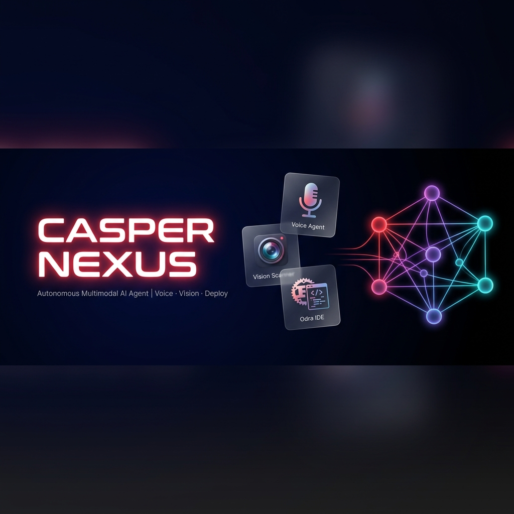

# Casper Nexus

<p align="center">
  
</p>

<p align="center">
  <strong>An autonomous multimodal AI Agent portal built for the Casper Agentic Buildathon 2026.</strong>
</p>

<p align="center">
  <a href="https://dorahacks.io/hackathon/casper-agentic-buildathon/buidl">
    
  </a>
  
  
  
  
</p>

---

## 🌐 What is Casper Nexus?

**Casper Nexus** is a browser-based autonomous AI agent that fuses:
- 🎙️ **Voice Commands** — Speak naturally to stake, swap, check balances, or deploy contracts
- 👁️ **Computer Vision** — Point your camera at objects or flowcharts to trigger on-chain actions
- 💸 **x402 Micropayments** — Every agent call settles autonomously via HTTP-native CSPR micropayments
- 🦀 **Odra Rust IDE** — Write, compile, and deploy smart contracts in-browser without setup

All powered by the **Casper Network** (Proof-of-Stake Layer-1 blockchain).

---

## 🖥️ Live Demo

| View | Description |
|------|-------------|
| **Landing Page** | Full marketing site with Features, How It Works, Models, Use Cases, FAQ |
| **Dashboard App** | Agentic AI portal with Voice Agent, Vision Scanner, Odra Rust IDE |

---

## ✨ Core Features

| Module | Tech | Description |
|--------|------|-------------|
| 🎙️ Voice Intelligence Agent | Web Speech API (STT/TTS) | Natural language commands for DeFi operations |
| 👁️ Real-World Vision Scanner | MediaDevices API | Camera HUD with object detection & NFT minting |
| 🦀 Odra Rust IDE | Cargo WASM | In-browser smart contract editor with deploy |
| ⚡ x402 Micropayments | HTTP-native protocol | Autonomous per-query CSPR payment channels |
| 🖼️ CEP-78 NFT Minting | Casper CEP-78 standard | Scan physical assets → register digital twins |
| 📊 Chain Metrics Console | Casper Testnet RPC | Live block explorer, billing ledger, staking ring |

---

## 🏗️ Architecture

```
Landing Page (LandingPage.tsx)
├── Navbar          — Sticky nav with smooth-scroll links
├── LiveTickerBar   — Real-time CSPR price, block height, TPS
├── Hero            — Split layout with orbital hub & floating activity cards
├── Features        — 6 capability cards
├── HowItWorks      — 4-step workflow
├── Models          — Tech stack: Blockchain, AI & Voice, Payments
├── UseCases        — 6 real-world scenarios
├── About           — Dev timeline & builder profile
├── FAQ             — 6-item accordion FAQ
├── CTA             — Launch App + GitHub buttons
└── Footer          — Links to GitHub, DoraHacks, Casper Docs

Dashboard App (Dashboard.tsx)
├── Voice Agent     — Mic orb, waveform, transcript bubbles, quick commands
├── Vision Agent    — Camera viewport with HUD, bounding boxes, NFT gallery
├── Odra Rust IDE   — Code editor with compiler profile & deploy workflow
└── Metrics Panel   — Staking ring, x402 balance chart, log console & billing ledger
```

---

## 🛠️ Tech Stack

| Layer | Technology |
|-------|-----------|
| **Frontend** | React 19 + TypeScript + Vite 8 |
| **Styling** | Vanilla CSS — glassmorphism, neon gradients, keyframe animations |
| **Icons** | Lucide React |
| **Blockchain** | Casper Testnet RPC, Odra Framework, CEP-78 |
| **AI / Voice** | Web Speech API (STT + TTS), Vision Inference simulation |
| **Payments** | x402 HTTP-native micropayment protocol |
| **Smart Contracts** | Rust + Odra framework → WASM32 |

---

## 🚀 Getting Started

```bash
# Clone the repo
git clone https://github.com/bakarezainab/Casper-Nexus.git
cd Casper-Nexus

# Install dependencies
npm install

# Start development server
npm run dev

# Build for production
npm run build
```

Open [http://localhost:5173](http://localhost:5173) — the landing page loads by default. Click **Launch App** to enter the agentic dashboard.

---

## 🗂️ Project Structure

```
casper-nexus/
├── public/
│   ├── banner.png       # Project banner image
│   ├── hero_bg.png      # Landing page hero background
│   └── favicon.svg      # App favicon
├── src/
│   ├── components/
│   │   ├── Navbar.tsx         # Sticky navigation
│   │   ├── Hero.tsx           # Hero section (split layout)
│   │   ├── LiveTickerBar.tsx  # Live network metrics
│   │   ├── Features.tsx       # Feature cards
│   │   ├── HowItWorks.tsx     # Step-by-step flow
│   │   ├── Models.tsx         # Tech stack cards
│   │   ├── UseCases.tsx       # Use case grid
│   │   ├── About.tsx          # Builder + timeline
│   │   ├── FAQ.tsx            # Accordion FAQ
│   │   ├── CTA.tsx            # Call-to-action
│   │   ├── Footer.tsx         # Footer links
│   │   ├── AnimatedCounter.tsx # Eased number animation
│   │   └── ParticleBackground.tsx # Floating particles
│   ├── LandingPage.tsx    # Landing page assembler
│   ├── Dashboard.tsx      # AI agent dashboard
│   ├── main.tsx           # Router (landing ↔ dashboard)
│   ├── landing.css        # Landing page styles
│   ├── App.css            # Dashboard styles
│   └── index.css          # Global design tokens
└── README.md
```

---

## 📖 Hackathon Details

| Field | Details |
|-------|---------|
| **Event** | [Casper Agentic Buildathon 2026](https://dorahacks.io/hackathon/casper-agentic-buildathon/buidl) |
| **Platform** | DoraHacks |
| **Tracks** | Agentic AI · DeFi · Real-World Assets · Casper Network |
| **Builder** | Zainab Bakare ([@bakarezainab](https://github.com/bakarezainab)) |
| **Network** | Casper Testnet (node-1.testnet.casper.network) |

---

## 🤝 Links

- 🔗 **GitHub**: [github.com/bakarezainab/Casper-Nexus](https://github.com/bakarezainab/Casper-Nexus)
- 🏆 **DoraHacks**: [Casper Agentic Buildathon](https://dorahacks.io/hackathon/casper-agentic-buildathon/buidl)
- 📖 **Casper Docs**: [docs.casper.network](https://docs.casper.network)
- 🦀 **Odra Framework**: [odra.dev](https://odra.dev)
- ⚡ **x402 Protocol**: [x402.org](https://x402.org)

---

<p align="center">
  <em>© 2026 Casper Nexus — Built with ❤️ for the Casper Agentic Buildathon</em>
</p>
